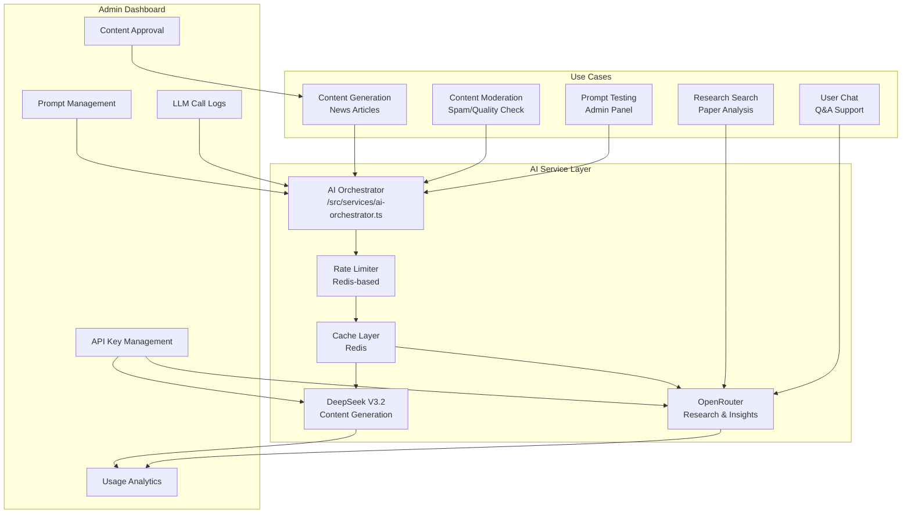

# GenAI4Code - Admin Dashboard & AI Integration Architecture

## 🎯 Executive Summary

This document outlines the complete admin dashboard architecture with DeepSeek V3.2 integration for content generation/moderation, OpenRouter for research/insights, and comprehensive management tools for content, API keys, usage tracking, and prompt management.

**AI Strategy**: DeepSeek V3.2 (paid) for content generation + OpenRouter (free) for research/insights  
**Admin Features**: Content management, API key management, usage analytics, LLM monitoring, prompt management  
**Cost**: DeepSeek ~$15-30/month + OpenRouter free tier

---

## 🤖 AI Integration Architecture

### Multi-Provider AI Strategy



### DeepSeek V3.2 Integration

```typescript
// src/services/deepseek-client.ts
import axios from 'axios';

export interface DeepSeekConfig {
  apiKey: string;
  baseURL: string;
  model: 'deepseek-chat' | 'deepseek-reasoner';
}

export class DeepSeekClient {
  private config: DeepSeekConfig;
  private client: axios.AxiosInstance;

  constructor(config: DeepSeekConfig) {
    this.config = config;
    this.client = axios.create({
      baseURL: config.baseURL,
      headers: {
        'Authorization': `Bearer ${config.apiKey}`,
        'Content-Type': 'application/json',
      },
    });
  }

  // Content Generation (Non-thinking mode)
  async generateContent(prompt: string, options: {
    maxTokens?: number;
    temperature?: number;
    jsonMode?: boolean;
  } = {}): Promise<string> {
    const response = await this.client.post('/chat/completions', {
      model: this.config.model,
      messages: [{ role: 'user', content: prompt }],
      max_tokens: options.maxTokens || 4000,
      temperature: options.temperature || 0.7,
      response_format: options.jsonMode ? { type: 'json_object' } : undefined,
    });

    return response.data.choices[0].message.content;
  }

  // Content Moderation (Thinking mode for analysis)
  async moderateContent(content: string): Promise<{
    isApproved: boolean;
    issues: string[];
    score: number;
  }> {
    const prompt = `Analyze this content for spam, quality, and appropriateness:
    
    ${content}
    
    Return JSON with: { "isApproved": boolean, "issues": string[], "score": number }`;
    
    const result = await this.generateContent(prompt, {
      maxTokens: 500,
      temperature: 0.3,
      jsonMode: true,
    });
    
    return JSON.parse(result);
  }

  // Cost calculation
  calculateCost(inputTokens: number, outputTokens: number, cacheHit: boolean = false): number {
    const inputCost = cacheHit ? 0.028 : 0.28; // per 1M tokens
    const outputCost = 0.42; // per 1M tokens
    
    return (inputTokens * inputCost / 1_000_000) + (outputTokens * outputCost / 1_000_000);
  }
}
```

### OpenRouter Integration (Free Tier)

```typescript
// src/services/openrouter-client.ts
export class OpenRouterClient {
  private apiKey: string;
  private baseURL = 'https://openrouter.ai/api/v1';

  constructor(apiKey: string) {
    this.apiKey = apiKey;
  }

  // Research paper analysis
  async analyzePaper(paper: {
    title: string;
    abstract: string;
    authors: string[];
  }): Promise<{
    summary: string;
    keyFindings: string[];
    relevanceScore: number;
  }> {
    const prompt = `Analyze this research paper and provide insights:
    
    Title: ${paper.title}
    Authors: ${paper.authors.join(', ')}
    Abstract: ${paper.abstract}
    
    Provide a summary, key findings, and relevance score (1-10).`;
    
    const response = await fetch(`${this.baseURL}/chat/completions`, {
      method: 'POST',
      headers: {
        'Authorization': `Bearer ${this.apiKey}`,
        'Content-Type': 'application/json',
        'HTTP-Referer': 'https://genai4code.com',
        'X-Title': 'GenAI4Code',
      },
      body: JSON.stringify({
        model: 'google/gemini-2.0-flash-exp:free',
        messages: [{ role: 'user', content: prompt }],
        max_tokens: 1000,
      }),
    });

    const data = await response.json();
    return this.parseAnalysis(data.choices[0].message.content);
  }

  // User Q&A
  async answerQuestion(question: string, context: string): Promise<string> {
    const prompt = `Answer this question based on the provided context:
    
    Context: ${context}
    Question: ${question}
    
    If the answer is not in the context, say so.`;
    
    const response = await fetch(`${this.baseURL}/chat/completions`, {
      method: 'POST',
      headers: {
        'Authorization': `Bearer ${this.apiKey}`,
        'Content-Type': 'application/json',
        'HTTP-Referer': 'https://genai4code.com',
        'X-Title': 'GenAI4Code',
      },
      body: JSON.stringify({
        model: 'google/gemini-2.0-flash-exp:free',
        messages: [{ role: 'user', content: prompt }],
        max_tokens: 500,
      }),
    });

    const data = await response.json();
    return data.choices[0].message.content;
  }
}
```

### AI Orchestrator Service

```typescript
// src/services/ai-orchestrator.ts
export interface AIOptions {
  taskType: 'content-generation' | 'moderation' | 'research' | 'chat' | 'prompt-test';
  priority: 'low' | 'medium' | 'high';
  modelPreference?: string;
}

export class AIOrchestrator {
  private deepseek: DeepSeekClient;
  private openrouter: OpenRouterClient;
  private redis: Redis;

  constructor(config: {
    deepseekApiKey: string;
    openrouterApiKey: string;
    redisUrl: string;
  }) {
    this.deepseek = new DeepSeekClient({
      apiKey: config.deepseekApiKey,
      baseURL: 'https://api.deepseek.com',
      model: 'deepseek-chat',
    });
    this.openrouter = new OpenRouterClient(config.openrouterApiKey);
    this.redis = new Redis(config.redisUrl);
  }

  async generateContent(prompt: string, options: AIOptions) {
    // Track usage
    const startTime = Date.now();
    let provider: string;
    let result: any;
    let cost = 0;

    try {
      switch (options.taskType) {
        case 'content-generation':
          provider = 'deepseek';
          result = await this.deepseek.generateContent(prompt, {
            maxTokens: 4000,
            temperature: 0.7,
            jsonMode: options.taskType === 'moderation',
          });
          // Estimate tokens (rough calculation)
          const tokens = Math.ceil(prompt.length / 4) + Math.ceil(result.length / 4);
          cost = this.deepseek.calculateCost(tokens, tokens * 0.7);
          break;

        case 'moderation':
          provider = 'deepseek';
          result = await this.deepseek.moderateContent(prompt);
          break;

        case 'research':
        case 'chat':
          provider = 'openrouter';
          result = await this.openrouter.analyzePaper({
            title: prompt,
            abstract: '',
            authors: [],
          });
          break;

        case 'prompt-test':
          // Test both providers
          const [deepseekResult, openrouterResult] = await Promise.allSettled([
            this.deepseek.generateContent(prompt, { maxTokens: 500 }),
            this.openrouter.answerQuestion(prompt, 'Test context'),
          ]);
          result = {
            deepseek: deepseekResult.status === 'fulfilled' ? deepseekResult.value : null,
            openrouter: openrouterResult.status === 'fulfilled' ? openrouterResult.value : null,
          };
          provider = 'both';
          break;

        default:
          throw new Error(`Unknown task type: ${options.taskType}`);
      }

      // Log successful call
      await this.logLLMCall({
        provider,
        taskType: options.taskType,
        prompt: prompt.substring(0, 500), // Truncate for storage
        result: typeof result === 'string' ? result.substring(0, 500) : JSON.stringify(result).substring(0, 500),
        cost,
        duration: Date.now() - startTime,
        status: 'success',
      });

      return result;
    } catch (error) {
      // Log failed call
      await this.logLLMCall({
        provider: provider || 'unknown',
        taskType: options.taskType,
        prompt: prompt.substring(0, 500),
        result: null,
        cost: 0,
        duration: Date.now() - startTime,
        status: 'error',
        error: error.message,
      });

      throw error;
    }
  }

  private async logLLMCall(log: {
    provider: string;
    taskType: string;
    prompt: string;
    result: string | null;
    cost: number;
    duration: number;
    status: 'success' | 'error';
    error?: string;
  }) {
    await this.redis.lpush('llm-call-logs', JSON.stringify({
      ...log,
      timestamp: new Date().toISOString(),
    }));
    
    // Keep only last 1000 logs
    await this.redis.ltrim('llm-call-logs', 0, 999);
    
    // Update usage stats
    const today = new Date().toISOString().split('T')[0];
    await this.redis.incrby(`usage:daily:${today}:${log.provider}`, 1);
    await this.redis.incrbyfloat(`cost:daily:${today}:${log.provider}`, log.cost);
  }
}
```

---

## 🎛️ Admin Dashboard Architecture

### Admin Dashboard Structure

```
Admin Dashboard (/admin)
├── Dashboard Home
│   ├── Usage Overview
│   ├── Recent Activity
│   └── Quick Actions
│
├── Content Management
│   ├── Create Content
│   ├── Edit Content
│   ├── Content Approval Queue
│   └── Bulk Operations
│
├── AI & API Management
│   ├── API Keys
│   ├── LLM Call Logs
│   ├── Usage Analytics
│   └── Prompt Management
│
├── User Management
│   ├── User List
│   ├── User Roles
│   └── User Analytics
│
└── System Settings
    ├── General Settings
    ├── AI Provider Settings
    └── Backup & Export
```

### Admin Authentication

```typescript
// backend/src/middleware/admin-auth.ts
import { Request, Response, NextFunction } from 'express';
import jwt from 'jsonwebtoken';

export interface AdminUser {
  id: string;
  email: string;
  role: 'admin' | 'super_admin';
  permissions: string[];
}

export function requireAdmin(req: Request, res: Response, next: NextFunction) {
  const token = req.headers.authorization?.replace('Bearer ', '');
  
  if (!token) {
    return res.status(401).json({ error: 'Admin authentication required' });
  }

  try {
    const decoded = jwt.verify(token, process.env.JWT_SECRET) as AdminUser;
    
    if (decoded.role !== 'admin' && decoded.role !== 'super_admin') {
      return res.status(403).json({ error: 'Admin privileges required' });
    }
    
    req.admin = decoded;
    next();
  } catch (error) {
    return res.status(401).json({ error: 'Invalid admin token' });
  }
}

// Super admin only routes
export function requireSuperAdmin(req: Request, res: Response, next: NextFunction) {
  if (req.admin?.role !== 'super_admin') {
    return res.status(403).json({ error: 'Super admin privileges required' });
  }
  next();
}
```

### API Key Management System

```typescript
// backend/src/models/api-key.ts
export interface ApiKey {
  id: string;
  name: string;
  keyHash: string;
  keyPreview: string; // Last 4 characters
  userId: string;
  permissions: string[]; // ['content:read', 'content:write', 'ai:generate']
  isActive: boolean;
  usageLimit: number | null; // Monthly limit
  usageCount: number;
  lastUsedAt: Date | null;
  createdAt: Date;
  expiresAt: Date | null;
}

// API Key Service
export class ApiKeyService {
  async createApiKey(data: {
    name: string;
    userId: string;
    permissions: string[];
    usageLimit?: number;
    expiresInDays?: number;
  }): Promise<{ apiKey: ApiKey; plainTextKey: string }> {
    const plainTextKey = `g4c_${crypto.randomBytes(32).toString('hex')}`;
    const keyHash = crypto.createHash('sha256').update(plainTextKey).digest('hex');
    const keyPreview = plainTextKey.slice(-4);

    const apiKey = await prisma.apiKey.create({
      data: {
        name: data.name,
        keyHash,
        keyPreview,
        userId: data.userId,
        permissions: data.permissions,
        usageLimit: data.usageLimit || null,
        usageCount: 0,
        expiresAt: data.expiresInDays 
          ? new Date(Date.now() + data.expiresInDays * 24 * 60 * 60 * 1000)
          : null,
      },
    });

    return { apiKey, plainTextKey };
  }

  async validateApiKey(plainTextKey: string): Promise<ApiKey | null> {
    const keyHash = crypto.createHash('sha256').update(plainTextKey).digest('hex');
    
    const apiKey = await prisma.apiKey.findUnique({
      where: { keyHash },
    });

    if (!apiKey) return null;
    if (!apiKey.isActive) return null;
    if (apiKey.expiresAt && apiKey.expiresAt < new Date()) return null;
    if (apiKey.usageLimit && apiKey.usageCount >= apiKey.usageLimit) return null;

    return apiKey;
  }

  async incrementUsage(apiKeyId: string): Promise<void> {
    await prisma.apiKey.update({
      where: { id: apiKeyId },
      data: {
        usageCount: { increment: 1 },
        lastUsedAt: new Date(),
      },
    });
  }

  async getApiKeyUsage(apiKeyId: string, days: number = 30) {
    const usage = await prisma.apiCallLogs.findMany({
      where: {
        apiKeyId,
        timestamp: {
          gte: new Date(Date.now() - days * 24 * 60 * 60 * 1000),
        },
      },
      orderBy: { timestamp: 'desc' },
    });

    return {
      totalCalls: usage.length,
      callsByDay: this.groupByDay(usage),
      cost: usage.reduce((sum, log) => sum + (log.cost || 0), 0),
      errors: usage.filter(log => log.status === 'error').length,
    };
  }
}
```

### Usage Analytics System

```typescript
// backend/src/services/usage-analytics.ts
export interface UsageMetrics {
  daily: {
    date: string;
    totalCalls: number;
    totalCost: number;
    byProvider: Record<string, { calls: number; cost: number }>;
    byEndpoint: Record<string, number>;
  }[];
  summary: {
    totalCalls: number;
    totalCost: number;
    avgResponseTime: number;
    errorRate: number;
    topEndpoints: string[];
  };
}

export class UsageAnalyticsService {
  async getDailyUsage(days: number = 30): Promise<UsageMetrics> {
    const endDate = new Date();
    const startDate = new Date(endDate.getTime() - days * 24 * 60 * 60 * 1000);

    const logs = await prisma.apiCallLogs.findMany({
      where: {
        timestamp: { gte: startDate, lte: endDate },
      },
      orderBy: { timestamp: 'desc' },
    });

    const daily = this.groupByDate(logs);
    const summary = this.calculateSummary(logs);

    return { daily, summary };
  }

  async getLLMCallLogs(limit: number = 100, offset: number = 0) {
    return await prisma.lLMCallLog.findMany({
      orderBy: { timestamp: 'desc' },
      take: limit,
      skip: offset,
      include: {
        user: {
          select: { id: true, email: true },
        },
      },
    });
  }

  async getLLMCallStats(days: number = 7) {
    const logs = await prisma.lLMCallLog.findMany({
      where: {
        timestamp: {
          gte: new Date(Date.now() - days * 24 * 60 * 60 * 1000),
        },
      },
    });

    return {
      totalCalls: logs.length,
      totalCost: logs.reduce((sum, log) => sum + log.cost, 0),
      byProvider: this.groupByProvider(logs),
      byModel: this.groupByModel(logs),
      avgDuration: logs.reduce((sum, log) => sum + log.duration, 0) / logs.length,
      errorRate: logs.filter(log => log.status === 'error').length / logs.length,
    };
  }
}
```

---

## 📝 Prompt Management System

### Prompt Database Schema

```prisma
model PromptTemplate {
  id          String   @id @default(uuid())
  name        String   @unique
  description String?
  content     String   @db.Text
  version     Int      @default(1)
  isActive    Boolean  @default(true)
  variables   Json?    // { "name": "description", ... }
