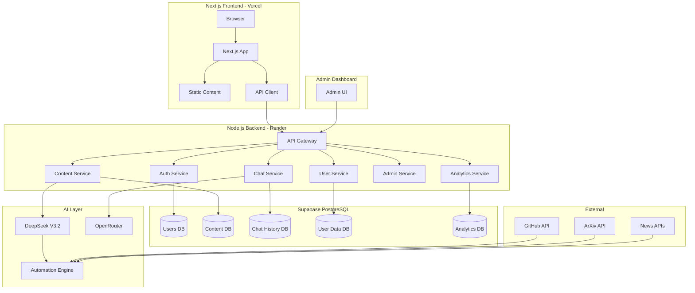
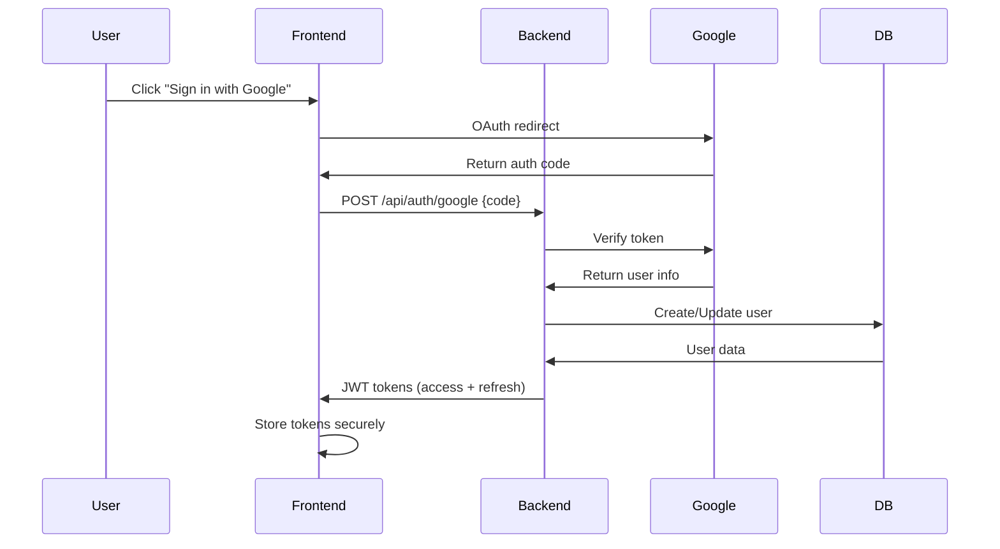
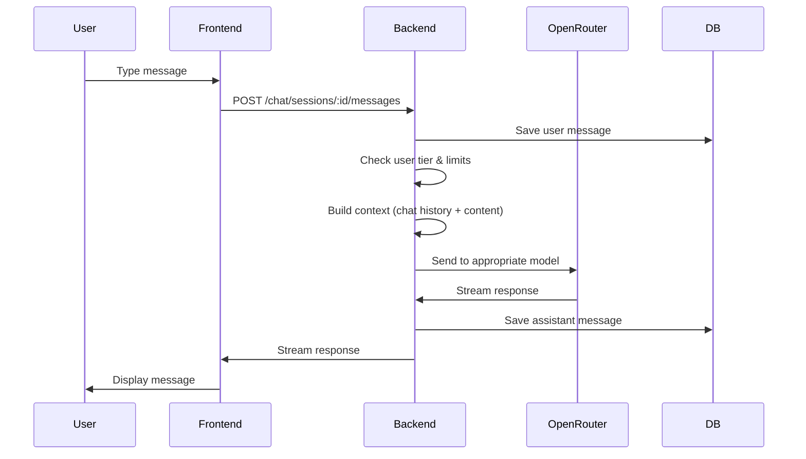
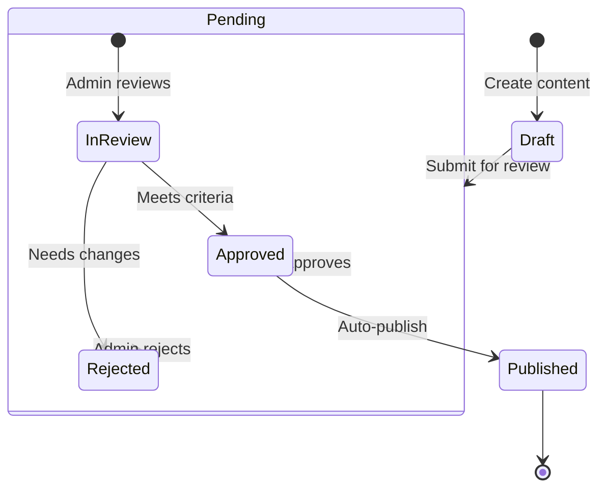
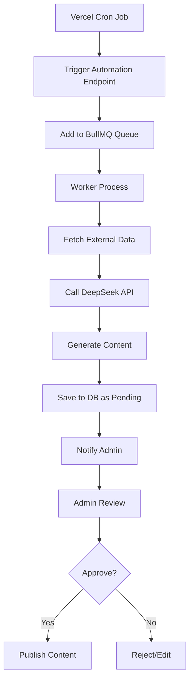

# GenAI4Code Architecture Master Plan

## Executive Summary

Complete architecture redesign separating frontend (Next.js) from backend (Node.js/Express) with comprehensive authentication, subscription tiers, content management, and AI-powered automation.

**Key Principles:**
- Complete separation of concerns: Frontend = UI only, Backend = All data & logic
- Multi-modal AI integration: DeepSeek for automation, OpenRouter for user chat
- Scalable subscription model: Free vs Premium tiers
- User-contributed content with approval workflow
- Personalized recommendations based on behavior
- Comprehensive admin dashboard for full platform control

---

## 1. System Architecture Overview



---

## 2. Authentication & Authorization

### 2.1 Authentication Methods
- **Google OAuth** (primary)
- **Email/Password** (secondary)
- **JWT-based session management**

### 2.2 User Roles & Tiers

| Tier | Price | Features | Limits |
|------|-------|----------|--------|
| **Free** | $0 | Basic content access, Research chat, Learning chat | 50 chat messages/day, No API access, Basic recommendations |
| **Premium** | $9/month | Unlimited chat, Saved history, API access, Advanced recommendations | Unlimited messages, API key (1000 req/day), Full history, Priority support |

### 2.3 Authentication Flow


---

## 3. Database Schema Design

### 3.1 Core Tables

```sql
-- Users table
CREATE TABLE users (
    id UUID PRIMARY KEY,
    email VARCHAR(255) UNIQUE NOT NULL,
    name VARCHAR(255),
    avatar_url TEXT,
    tier VARCHAR(20) DEFAULT 'free', -- free, premium
    interests JSONB, -- Store user interests for personalization
    created_at TIMESTAMP DEFAULT NOW(),
    updated_at TIMESTAMP DEFAULT NOW()
);

-- Content tables
CREATE TABLE content_items (
    id UUID PRIMARY KEY,
    type VARCHAR(50) NOT NULL, -- news, engineering, research, product
    title VARCHAR(500) NOT NULL,
    slug VARCHAR(500) UNIQUE NOT NULL,
    excerpt TEXT,
    content TEXT,
    author VARCHAR(255),
    category VARCHAR(100),
    tags JSONB,
    status VARCHAR(20) DEFAULT 'draft', -- draft, pending, approved, rejected
    featured BOOLEAN DEFAULT false,
    metadata JSONB, -- Store additional type-specific data
    contributor_id UUID REFERENCES users(id), -- For user-contributed content
    created_at TIMESTAMP DEFAULT NOW(),
    updated_at TIMESTAMP DEFAULT NOW(),
    published_at TIMESTAMP
);

-- Chat history
CREATE TABLE chat_sessions (
    id UUID PRIMARY KEY,
    user_id UUID REFERENCES users(id),
    mode VARCHAR(50) NOT NULL, -- research, learning
    title VARCHAR(255), -- Auto-generated from first message
    created_at TIMESTAMP DEFAULT NOW(),
    updated_at TIMESTAMP DEFAULT NOW()
);

CREATE TABLE chat_messages (
    id UUID PRIMARY KEY,
    session_id UUID REFERENCES chat_sessions(id),
    role VARCHAR(20) NOT NULL, -- user, assistant
    content TEXT NOT NULL,
    model_used VARCHAR(100), -- Track which model was used
    tokens_used INTEGER, -- For usage tracking
    created_at TIMESTAMP DEFAULT NOW()
);

-- User contributions
CREATE TABLE user_contributions (
    id UUID PRIMARY KEY,
    user_id UUID REFERENCES users(id),
    type VARCHAR(50) NOT NULL, -- product, tool, feedback
    content JSONB NOT NULL, -- Store contribution data
    status VARCHAR(20) DEFAULT 'pending', -- pending, approved, rejected
    admin_notes TEXT,
    created_at TIMESTAMP DEFAULT NOW()
);

-- User feedback
CREATE TABLE user_feedback (
    id UUID PRIMARY KEY,
    user_id UUID REFERENCES users(id),
    content_id UUID REFERENCES content_items(id),
    page_url VARCHAR(500),
    feedback_type VARCHAR(50), -- like, dislike, suggestion, bug
    comment TEXT,
    created_at TIMESTAMP DEFAULT NOW()
);

-- API keys for premium users
CREATE TABLE api_keys (
    id UUID PRIMARY KEY,
    user_id UUID REFERENCES users(id),
    key_hash VARCHAR(255) UNIQUE NOT NULL,
    name VARCHAR(255),
    permissions JSONB, -- Store allowed endpoints
    usage_count INTEGER DEFAULT 0,
    last_used_at TIMESTAMP,
    created_at TIMESTAMP DEFAULT NOW(),
    expires_at TIMESTAMP
);

-- AI model configuration
CREATE TABLE ai_models (
    id UUID PRIMARY KEY,
    name VARCHAR(255) NOT NULL,
    provider VARCHAR(100) NOT NULL, -- deepseek, openrouter
    model_id VARCHAR(255) NOT NULL,
    config JSONB, -- Store model-specific config
    is_active BOOLEAN DEFAULT true,
    use_case VARCHAR(100), -- automation, chat_research, chat_learning
    cost_per_1k_tokens DECIMAL(10,6),
    created_at TIMESTAMP DEFAULT NOW()
);

-- Automation jobs
CREATE TABLE automation_jobs (
    id UUID PRIMARY KEY,
    job_type VARCHAR(100) NOT NULL, -- news_generation, content_curation
    status VARCHAR(20) DEFAULT 'pending', -- pending, running, completed, failed
    config JSONB, -- Job-specific configuration
    result JSONB, -- Store job results
    error TEXT,
    started_at TIMESTAMP,
    completed_at TIMESTAMP,
    created_at TIMESTAMP DEFAULT NOW()
);

-- Analytics events
CREATE TABLE analytics_events (
    id UUID PRIMARY KEY,
    user_id UUID REFERENCES users(id),
    event_type VARCHAR(100) NOT NULL, -- page_view, chat_message, content_click
    properties JSONB,
    created_at TIMESTAMP DEFAULT NOW()
);
```

---

## 4. Backend API Architecture

### 4.1 API Structure (Node.js/Express)

```
backend/
├── src/
│   ├── controllers/
│   │   ├── auth.controller.ts
│   │   ├── content.controller.ts
│   │   ├── chat.controller.ts
│   │   ├── user.controller.ts
│   │   ├── admin.controller.ts
│   │   └── analytics.controller.ts
│   ├── services/
│   │   ├── auth.service.ts
│   │   ├── content.service.ts
│   │   ├── chat.service.ts
│   │   ├── ai.service.ts
│   │   ├── recommendation.service.ts
│   │   └── automation.service.ts
│   ├── middleware/
│   │   ├── auth.middleware.ts
│   │   ├── rateLimit.middleware.ts
│   │   └── errorHandler.middleware.ts
│   ├── routes/
│   │   ├── auth.routes.ts
│   │   ├── content.routes.ts
│   │   ├── chat.routes.ts
│   │   ├── user.routes.ts
│   │   ├── admin.routes.ts
│   │   └── api.routes.ts
│   ├── utils/
│   │   ├── jwt.ts
│   │   ├── logger.ts
│   │   └── validators.ts
│   └── config/
│       ├── database.ts
│       ├── ai.ts
│       └── index.ts
```

### 4.2 API Endpoints (60+ endpoints)

#### Authentication Routes (`/api/auth`)
- `POST /auth/register` - Email registration
- `POST /auth/login` - Email login
- `POST /auth/google` - Google OAuth
- `POST /auth/refresh` - Refresh token
- `POST /auth/logout` - Logout
- `POST /auth/forgot-password` - Password reset
- `POST /auth/reset-password` - Confirm password reset

#### Content Routes (`/api/content`)
- `GET /content` - List content (public)
- `GET /content/:id` - Get content detail (public)
- `GET /content/:id/recommendations` - Get personalized recommendations
- `POST /content` - Submit user contribution (authenticated)
- `POST /content/:id/feedback` - Submit feedback (authenticated)
- `GET /content/categories` - Get categories (public)
- `GET /content/tags` - Get tags (public)

#### Chat Routes (`/api/chat`)
- `GET /chat/sessions` - List user's chat sessions
- `POST /chat/sessions` - Create new chat session
- `GET /chat/sessions/:id` - Get session with messages
- `POST /chat/sessions/:id/messages` - Send message
- `DELETE /chat/sessions/:id` - Delete session
- `GET /chat/models` - Get available chat models

#### User Routes (`/api/user`)
- `GET /user/profile` - Get user profile
- `PUT /user/profile` - Update profile
- `GET /user/preferences` - Get user preferences
- `PUT /user/preferences` - Update preferences
- `GET /user/activity` - Get user activity history
- `GET /user/contributions` - Get user's contributions

#### Admin Routes (`/api/admin`)
- **Content Management**
  - `GET /admin/content` - List all content with filters
  - `PUT /admin/content/:id/status` - Update content status
  - `DELETE /admin/content/:id` - Delete content
  - `GET /admin/content/pending` - Get pending approvals

- **User Management**
  - `GET /admin/users` - List users
  - `GET /admin/users/:id` - Get user details
  - `PUT /admin/users/:id/tier` - Update user tier
  - `DELETE /admin/users/:id` - Delete user

- **AI Configuration**
  - `GET /admin/ai/models` - List AI models
  - `POST /admin/ai/models` - Add new model
  - `PUT /admin/ai/models/:id` - Update model
  - `DELETE /admin/ai/models/:id` - Delete model

- **Analytics**
  - `GET /admin/analytics/overview` - Get overview stats
  - `GET /admin/analytics/users` - Get user analytics
  - `GET /admin/analytics/content` - Get content analytics
  - `GET /admin/analytics/ai-usage` - Get AI usage stats

- **Automation**
  - `GET /admin/automation/jobs` - List automation jobs
  - `POST /admin/automation/jobs` - Trigger manual job
  - `GET /admin/automation/jobs/:id` - Get job details

#### API Routes (`/api/api-keys`)
- `GET /api-keys` - List user's API keys
- `POST /api-keys` - Create new API key
- `DELETE /api-keys/:id` - Delete API key
- `GET /api-keys/:id/usage` - Get API key usage

---

## 5. Chat System Architecture

### 5.1 Chat Modes
1. **Research/Insights Chat** - For discussing research papers and insights
2. **Learning Chat** - For engineering guides and educational content

### 5.2 Chat Flow


### 5.3 Chat Context Building
- **Research Chat**: Includes research paper content + chat history
- **Learning Chat**: Includes engineering guide content + chat history
- **Token Management**: Track usage per user, enforce tier limits

---

## 6. Content Management System

### 6.1 Content Types
1. **News** - AI industry news (automated + manual)
2. **Engineering Guides** - Educational content (user-contributed + admin)
3. **Research Insights** - Research papers and analysis (automated + manual)
4. **AI Products** - Product listings (user-contributed + admin)

### 6.2 Content Workflow


### 6.3 User Contributions
- **Product/Tool Submissions**: Users can submit AI products/tools
- **Content Suggestions**: Users can suggest improvements
- **Feedback**: Users can provide feedback on any page

---

## 7. AI Integration Strategy

### 7.1 Multi-Provider Setup

**DeepSeek V3.2** (Automation)
- Content generation for news
- Content generation for engineering guides
- Research paper summarization
- Cost: $0.28-0.42 per 1M tokens
- Usage: ~15-30M tokens/month = $15-30/month

**OpenRouter** (User Chat)
- Free tier models: Gemini 2.0 Flash, Llama 3.1
- Premium tier models: GPT-4o, Claude 3.5 Sonnet
- Cost: Free tier sufficient for most users
- Usage: 100K-500K tokens/month = $0-5/month

### 7.2 AI Model Configuration
```typescript
interface AIModelConfig {
  id: string;
  name: string;
  provider: 'deepseek' | 'openrouter';
  modelId: string;
  useCase: 'automation_news' | 'automation_learning' | 'chat_research' | 'chat_learning';
  isActive: boolean;
  costPer1kTokens: number;
  config: {
    temperature: number;
    maxTokens: number;
    topP: number;
    // Model-specific config
  };
}
```

---

## 8. Automation Pipeline

### 8.1 Automation Jobs
1. **News Generation** (Every 6 hours)
   - Scrape AI news sources
   - Generate 3 articles using DeepSeek
   - Store as pending for admin approval

2. **Research Curation** (Daily)
   - Fetch trending papers from arXiv
   - Generate summaries using DeepSeek
   - Store as pending for admin approval

3. **GitHub Monitoring** (Daily)
   - Monitor trending AI repositories
   - Generate product listings
   - Store as pending for admin approval

4. **Content Audit** (Weekly)
   - Review old content for accuracy
   - Flag outdated content
   - Generate update suggestions

### 8.2 Automation Flow


---

## 9. Analytics & Usage Tracking

### 9.1 Tracked Events
- **Page Views**: Track content engagement
- **Chat Messages**: Track chat usage by mode
- **Content Clicks**: Track recommendation effectiveness
- **User Contributions**: Track submission rates
- **API Usage**: Track API key usage

### 9.2 Analytics Dashboard
- **User Analytics**: Active users, tier distribution, engagement
- **Content Analytics**: Popular content, approval rates, contribution sources
- **AI Usage**: Token consumption, model performance, cost tracking
- **Revenue Analytics**: Subscription revenue, churn rate, LTV

---

## 10. Frontend Architecture

### 10.1 Next.js App Structure
```
website/
├── src/
│   ├── app/
│   │   ├── (public)/
│   │   │   ├── page.tsx (Home)
│   │   │   ├── news/
│   │   │   ├── engineering/
│   │   │   ├── research/
│   │   │   └── products/
│   │   ├── (auth)/
│   │   │   ├── login/
│   │   │   └── signup/
│   │   └── (dashboard)/
│   │       ├── chat/
│   │       ├── profile/
│   │       └── contributions/
│   ├── components/
│   │   ├── layout/
│   │   ├── content/
│   │   ├── chat/
│   │   └── admin/
│   ├── lib/
│   │   ├── api-client.ts (Backend API calls)
│   │   ├── auth.ts (Auth utilities)
│   │   └── analytics.ts
│   └── hooks/
│       ├── useAuth.ts
│       ├── useContent.ts
│       └── useChat.ts
```

### 10.2 API Client
```typescript
// All API calls go to backend
const API_BASE = process.env.NEXT_PUBLIC_API_URL;

class APIClient {
  // Auth
  async login(email: string, password: string) { /* ... */ }
  async googleLogin(code: string) { /* ... */ }
  
  // Content
  async getContent(filters: ContentFilters) { /* ... */ }
  async getContentDetail(id: string) { /* ... */ }
  async submitContribution(data: ContributionData) { /* ... */ }
  
  // Chat
  async getChatSessions() { /* ... */ }
  async sendMessage(sessionId: string, message: string) { /* ... */ }
  
  // User
  async getProfile() { /* ... */ }
  async updatePreferences(preferences: UserPreferences) { /* ... */ }
}
```

---

## 11. Admin Dashboard

### 11.1 Admin Sections
1. **Dashboard** - Overview stats and charts
2. **Content Management** - Approval queue, edit content
3. **AI Configuration** - Manage AI models and prompts
4. **User Management** - View users, manage tiers
5. **Analytics** - Detailed analytics and reports
6. **Automation** - Monitor and trigger automation jobs

### 11.2 Admin Features
- **Content Approval Queue**: Review pending contributions
- **AI Model Management**: Configure models for different use cases
- **Prompt Management**: Store and version prompts for automation
- **User Analytics**: Understand user behavior and interests
- **System Monitoring**: Track API health and performance

---

## 12. Deployment Architecture

### 12.1 Hosting Stack
- **Frontend**: Vercel (Free tier)
- **Backend**: Render ($7/month)
- **Database**: Supabase PostgreSQL (Free tier)
- **Redis**: Upstash (Free tier)
- **Storage**: Supabase Storage (Free tier)

### 12.2 Environment Variables

**Frontend (.env.local)**
```
NEXT_PUBLIC_API_URL=https://api.genai4code.com
NEXT_PUBLIC_SITE_URL=https://genai4code.com
```

**Backend (.env)**
```
# Database
DATABASE_URL=postgresql://...

# AI Providers
DEEPSEEK_API_KEY=sk-...
OPENROUTER_API_KEY=sk-or-...

# Auth
JWT_SECRET=...
GOOGLE_CLIENT_ID=...
GOOGLE_CLIENT_SECRET=...

# Redis (for queue)
REDIS_URL=redis://...
```

---

## 13. Cost Analysis

### 13.1 Monthly Costs (Starting)

| Service | Cost | Notes |
|---------|------|-------|
| **Render (Backend)** | $7 | 1 instance, 512MB RAM |
| **Supabase** | $0 | Free tier (500MB DB, 1GB storage) |
| **Vercel** | $0 | Free tier (Hobby) |
| **Upstash Redis** | $0 | Free tier (10k commands/day) |
| **DeepSeek V3.2** | $15-30 | 15-30M tokens/month |
| **OpenRouter** | $0-5 | Free tier + some paid usage |
| **Total** | **$22-42/month** | |

### 13.2 Scaling Costs (10K users)
- **Render**: $25-50/month (2-3 instances)
- **Supabase**: $25/month (Pro tier)
- **Vercel**: $20/month (Pro tier)
- **DeepSeek**: $100-150/month
- **OpenRouter**: $50-100/month
- **Total**: **$220-345/month**

---

## 14. Implementation Roadmap

### Phase 1: Foundation (Weeks 1-2)
- [ ] Set up backend project structure
- [ ] Configure database with Prisma
- [ ] Implement authentication system
- [ ] Create basic API structure

### Phase 2: Core Features (Weeks 3-5)
- [ ] Implement content management APIs
- [ ] Build chat system with history
- [ ] Create user profile and preferences
- [ ] Implement contribution system

### Phase 3: AI Integration (Weeks 6-7)
- [ ] Integrate DeepSeek for automation
- [ ] Integrate OpenRouter for chat
- [ ] Build automation pipeline
- [ ] Implement AI model configuration

### Phase 4: Admin Dashboard (Weeks 8-9)
- [ ] Build admin UI
- [ ] Implement content approval workflow
- [ ] Create analytics dashboard
- [ ] Build user management

### Phase 5: Frontend Integration (Weeks 10-11)
- [ ] Update API client
- [ ] Implement authentication UI
- [ ] Build chat interface
- [ ] Add contribution features

### Phase 6: Launch Prep (Week 12)
- [ ] Testing and bug fixes
- [ ] Performance optimization
- [ ] Documentation
- [ ] Production deployment

---

## 15. Security Considerations

### 15.1 Authentication Security
- JWT tokens with 15min access, 7day refresh
- Refresh token rotation
- Secure password hashing (bcrypt)
- Rate limiting on auth endpoints

### 15.2 API Security
- Rate limiting: 100 req/min (free), 1000 req/min (premium)
- API key authentication for premium features
- CORS configuration
- Input validation and sanitization

### 15.3 Data Security
- Row Level Security (RLS) in PostgreSQL
- Encrypted sensitive data
- Regular backups
- PII handling compliance

---

## 16. Monitoring & Observability

### 16.1 Logging
- **API Logs**: All requests and responses
- **Error Logs**: Structured error tracking
- **AI Logs**: Model usage and costs
- **User Logs**: Important user actions

### 16.2 Metrics
- **API Metrics**: Response times, error rates
- **User Metrics**: Active users, engagement
- **AI Metrics**: Token usage, model performance
- **Business Metrics**: Revenue, churn, LTV

### 16.3 Alerting
- **Critical**: API downtime, auth failures
- **Warning**: High error rates, cost spikes
- **Info**: Successful deployments, job completions

---

## 17. Success Metrics

### 17.1 Technical Metrics
- API response time < 200ms (p95)
- Uptime > 99.5%
- Error rate < 1%
- Chat response time < 3 seconds

### 17.2 Business Metrics
- User acquisition: 100 users/week
- Conversion rate: 5% free to premium
- Engagement: 10+ chats per user/week
- Content contribution: 10 submissions/week

---

## 18. Future Enhancements

### 18.1 Short Term (3 months)
- Mobile app (React Native)
- Chrome extension for quick access
- Slack/Discord integration
- Advanced search with filters

### 18.2 Long Term (6+ months)
- Multi-language support
- Team/organization accounts
- Custom model fine-tuning
- White-label solution
- Advanced analytics for enterprises

---

## 19. Risk Mitigation

### 19.1 Technical Risks
- **AI API Downtime**: Implement fallback models
- **Database Performance**: Implement caching, indexing
- **Scaling Issues**: Use connection pooling, horizontal scaling

### 19.2 Business Risks
- **Cost Overruns**: Monitor usage, implement hard limits
- **User Abuse**: Rate limiting, content moderation
- **Data Loss**: Regular backups, disaster recovery

---

## 20. Conclusion

This architecture provides a solid foundation for GenAI4Code with:
- **Clear separation** between frontend and backend
- **Scalable subscription model** with Free/Premium tiers
- **Comprehensive content management** with user contributions
- **Multi-modal AI integration** for different use cases
- **Complete admin control** over content and users
- **Cost-effective hosting** at $22-42/month to start

The architecture is designed to scale from 0 to 10K+ users while maintaining performance and cost-effectiveness.