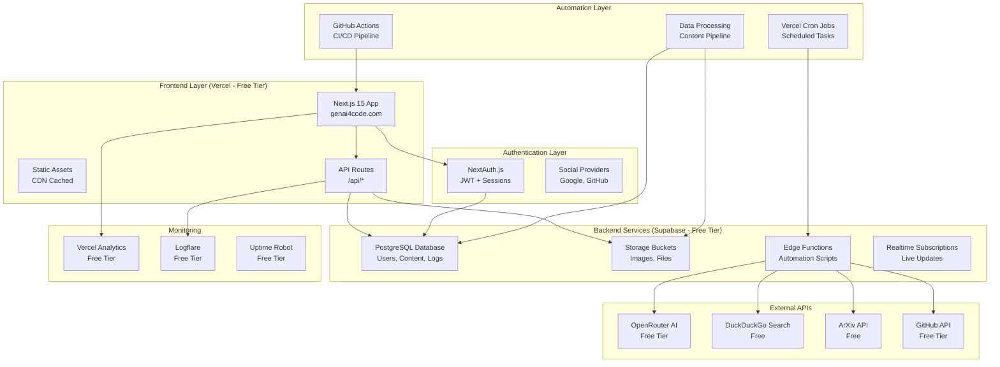
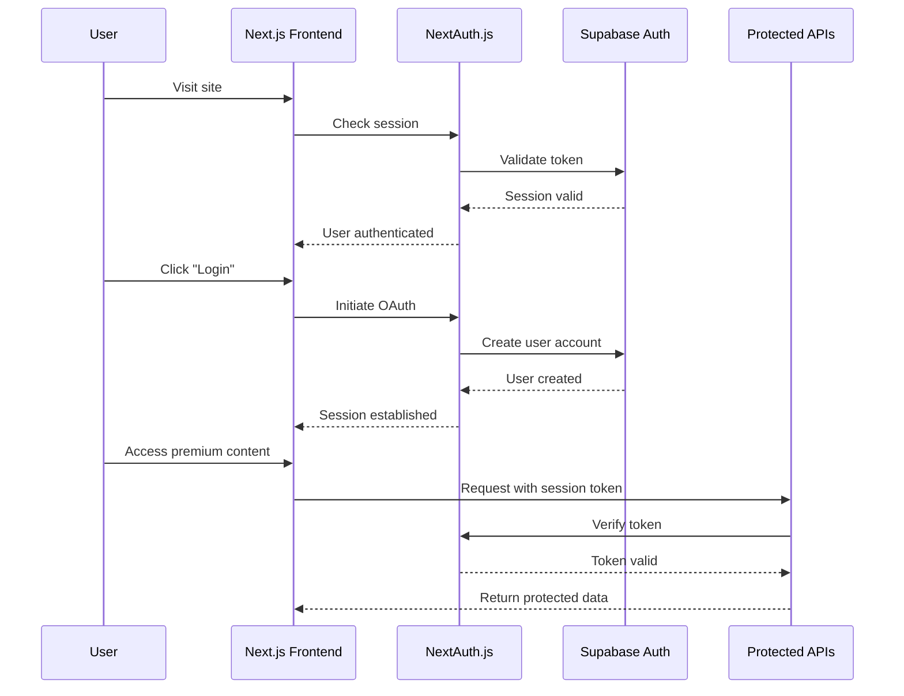
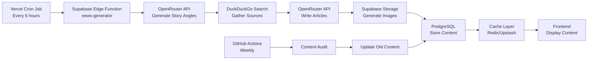

# GenAI4Code - Complete Architecture Solution

## 🎯 Executive Summary

This architecture provides a cost-effective, scalable solution for GenAI4Code with user authentication, automated data pipelines, and separated frontend/backend deployment using free/low-cost tiers of modern cloud services.

**Estimated Monthly Cost: $0-15/month** (primarily for production database when exceeding free tiers)

---

## 📊 Current Architecture Analysis

### ✅ Strengths
- Modern Next.js 15 with App Router
- TypeScript throughout
- AI integration with OpenRouter (free tier)
- Responsive design with Tailwind CSS
- Vercel-ready deployment

### ❌ Gaps Identified
- **No Authentication**: No user management or access control
- **No Real Backend**: File-based storage won't scale
- **No Automation**: Manual content gathering and processing
- **No API Security**: All endpoints are public
- **No Monitoring**: No error tracking or performance monitoring
- **Database Not Functional**: DynamoDB code exists but is disabled

---

## 🏗️ Proposed Architecture



---

## 🔐 Authentication Architecture

### User Flow


### Database Schema - Users & Authentication

```sql
-- Users table (managed by Supabase Auth)
-- id, email, encrypted_password, etc. (auto-created)

-- User profiles table
CREATE TABLE user_profiles (
    id UUID PRIMARY KEY REFERENCES auth.users(id),
    username TEXT UNIQUE,
    full_name TEXT,
    avatar_url TEXT,
    role TEXT DEFAULT 'user', -- user, admin, contributor
    subscription_tier TEXT DEFAULT 'free', -- free, pro, enterprise
    created_at TIMESTAMPTZ DEFAULT NOW(),
    updated_at TIMESTAMPTZ DEFAULT NOW()
);

-- User preferences
CREATE TABLE user_preferences (
    id UUID PRIMARY KEY DEFAULT gen_random_uuid(),
    user_id UUID REFERENCES auth.users(id),
    theme TEXT DEFAULT 'light',
    notifications_enabled BOOLEAN DEFAULT true,
    email_digest BOOLEAN DEFAULT true,
    preferred_categories TEXT[], -- AI, ML, DevOps, etc.
    created_at TIMESTAMPTZ DEFAULT NOW(),
    updated_at TIMESTAMPTZ DEFAULT NOW()
);

-- API keys for programmatic access
CREATE TABLE user_api_keys (
    id UUID PRIMARY KEY DEFAULT gen_random_uuid(),
    user_id UUID REFERENCES auth.users(id),
    name TEXT,
    key_hash TEXT UNIQUE,
    last_used_at TIMESTAMPTZ,
    created_at TIMESTAMPTZ DEFAULT NOW(),
    expires_at TIMESTAMPTZ
);
```

---

## 💾 Database Architecture

### Content Management Schema

```sql
-- Main content table (replaces DynamoDB)
CREATE TABLE content_items (
    id UUID PRIMARY KEY DEFAULT gen_random_uuid(),
    slug TEXT UNIQUE NOT NULL,
    title TEXT NOT NULL,
    type TEXT NOT NULL, -- news, engineering, research, product
    category TEXT,
    content TEXT NOT NULL,
    excerpt TEXT,
    author TEXT,
    author_id UUID REFERENCES auth.users(id),
    status TEXT DEFAULT 'draft', -- draft, published, archived
    published_at TIMESTAMPTZ,
    created_at TIMESTAMPTZ DEFAULT NOW(),
    updated_at TIMESTAMPTZ DEFAULT NOW(),
    metadata JSONB, -- flexible metadata storage
    view_count INTEGER DEFAULT 0,
    like_count INTEGER DEFAULT 0,
    share_count INTEGER DEFAULT 0
);

-- Tags for content
CREATE TABLE content_tags (
    id UUID PRIMARY KEY DEFAULT gen_random_uuid(),
    name TEXT UNIQUE NOT NULL,
    slug TEXT UNIQUE NOT NULL,
    description TEXT,
    color TEXT
);

-- Content-tag relationships
CREATE TABLE content_tag_relations (
    content_id UUID REFERENCES content_items(id) ON DELETE CASCADE,
    tag_id UUID REFERENCES content_tags(id) ON DELETE CASCADE,
    PRIMARY KEY (content_id, tag_id)
);

-- Comments system
CREATE TABLE content_comments (
    id UUID PRIMARY KEY DEFAULT gen_random_uuid(),
    content_id UUID REFERENCES content_items(id) ON DELETE CASCADE,
    user_id UUID REFERENCES auth.users(id),
    parent_id UUID REFERENCES content_comments(id), -- For nested comments
    content TEXT NOT NULL,
    status TEXT DEFAULT 'approved', -- approved, pending, spam
    created_at TIMESTAMPTZ DEFAULT NOW(),
    updated_at TIMESTAMPTZ DEFAULT NOW()
);

-- User interactions
CREATE TABLE user_interactions (
    id UUID PRIMARY KEY DEFAULT gen_random_uuid(),
    user_id UUID REFERENCES auth.users(id),
    content_id UUID REFERENCES content_items(id) ON DELETE CASCADE,
    interaction_type TEXT NOT NULL, -- view, like, share, bookmark
    created_at TIMESTAMPTZ DEFAULT NOW(),
    UNIQUE(user_id, content_id, interaction_type)
);
```

### Automation & Logging Schema

```sql
-- Automation jobs
CREATE TABLE automation_jobs (
    id UUID PRIMARY KEY DEFAULT gen_random_uuid(),
    job_type TEXT NOT NULL, -- news_generation, content_curation, data_sync
    status TEXT DEFAULT 'pending', -- pending, running, completed, failed
    parameters JSONB,
    result JSONB,
    error_message TEXT,
    started_at TIMESTAMPTZ,
    completed_at TIMESTAMPTZ,
    created_at TIMESTAMPTZ DEFAULT NOW()
);

-- External API calls log
CREATE TABLE api_call_logs (
    id UUID PRIMARY KEY DEFAULT gen_random_uuid(),
    provider TEXT NOT NULL, -- openrouter, github, arxiv, etc.
    endpoint TEXT,
    status_code INTEGER,
    response_time_ms INTEGER,
    cost_usd DECIMAL(10,6),
    error_message TEXT,
    created_at TIMESTAMPTZ DEFAULT NOW()
);

-- Content sources tracking
CREATE TABLE content_sources (
    id UUID PRIMARY KEY DEFAULT gen_random_uuid(),
    name TEXT NOT NULL,
    url TEXT,
    source_type TEXT, -- rss, api, webhook, manual
    last_fetched_at TIMESTAMPTZ,
    fetch_frequency TEXT, -- hourly, daily, weekly
    is_active BOOLEAN DEFAULT true,
    config JSONB -- API keys, endpoints, etc.
);
```

---

## 🤖 Automation Pipeline Architecture

### Content Generation Flow



### Data Processing Pipeline

```javascript
// Automation workflow steps
const automationWorkflow = {
    // 1. News Generation (Every 6 hours)
    newsGeneration: {
        trigger: "cron('0 */6 * * *')", // Every 6 hours
        steps: [
            "Generate 3 story angles using AI",
            "Search for recent sources (DuckDuckGo)",
            "Write full articles with citations",
            "Generate featured images (Pollinations.ai)",
            "Store in database with 'pending' status",
            "Send notification to admin for review"
        ]
    },
    
    // 2. Research Paper Curation (Daily)
    researchCuration: {
        trigger: "cron('0 2 * * *')", // Daily at 2 AM
        steps: [
            "Fetch trending papers from ArXiv",
            "Extract abstracts and metadata",
            "Generate summaries using AI",
            "Categorize by topic/tags",
            "Store in database",
            "Update search index"
        ]
    },
    
    // 3. GitHub Repository Monitoring (Daily)
    githubMonitoring: {
        trigger: "cron('0 3 * * *')", // Daily at 3 AM
        steps: [
            "Search trending AI repositories",
            "Extract README and metadata",
            "Generate project descriptions",
            "Categorize by tech stack",
            "Store as product listings"
        ]
    },
    
    // 4. Content Audit (Weekly)
    contentAudit: {
        trigger: "cron('0 4 * * 0')", // Weekly on Sunday
        steps: [
            "Identify outdated content (>30 days)",
            "Check for broken links",
            "Update view counts and engagement",
            "Generate performance reports",
            "Archive low-performing content"
        ]
    }
};
```

---

## 🏠 Hosting Architecture

### Frontend (Vercel - Free Tier)
```yaml
Service: Vercel Hobby Plan
Cost: $0/month
Features:
  - 100GB bandwidth
  - 6000 build minutes
  - Serverless Functions
  - Automatic HTTPS
  - Custom domains
  - Preview deployments
  - Basic analytics

Configuration:
  Framework: Next.js 15
  Build Command: npm run build
  Output Directory: .next
  Environment Variables:
    - NEXTAUTH_URL
    - NEXTAUTH_SECRET
    - SUPABASE_URL
    - SUPABASE_ANON_KEY
    - SUPABASE_SERVICE_KEY
    - OPENROUTER_API_KEY
```

### Backend (Supabase - Free Tier)
```yaml
Service: Supabase Free Tier
Cost: $0/month
Features:
  - 500MB database storage
  - 1GB file storage
  - 50,000 monthly active users
  - 500MB bandwidth
  - Edge Functions
  - Realtime subscriptions
  - Authentication
  - Storage API

Database: PostgreSQL 15
Storage: S3-compatible
Edge Functions: Deno runtime
Authentication: Row Level Security (RLS)
```

### Additional Services (Free Tier)

```yaml
# Monitoring & Analytics
Logflare:
  Cost: $0/month (1M events)
  Use: API logging, error tracking

Uptime Robot:
  Cost: $0/month (50 monitors)
  Use: Site monitoring, alerts

# Caching (Optional - when scaling)
Upstash Redis:
  Cost: $0/month (10k commands/day)
  Use: API response caching, rate limiting

# Image Optimization
Cloudinary:
  Cost: $0/month (25k transformations)
  Use: Image optimization, responsive images
```

---

## 🔒 API Security Architecture

### Authentication Middleware

```typescript
// src/lib/auth/middleware.ts
import { NextResponse } from 'next/server';
import { createRouteHandlerClient } from '@supabase/auth-helpers-nextjs';
import { cookies } from 'next/headers';

export async function withAuth(
  request: Request,
  handler: (user: any) => Promise<Response>
) {
  const supabase = createRouteHandlerClient({ cookies });
  const { data: { session } } = await supabase.auth.getSession();

  if (!session) {
    return NextResponse.json({ error: 'Unauthorized' }, { status: 401 });
  }

  // Check user role/permissions
  const { data: profile } = await supabase
    .from('user_profiles')
    .select('role, subscription_tier')
    .eq('id', session.user.id)
    .single();

  if (!profile) {
    return NextResponse.json({ error: 'Profile not found' }, { status: 404 });
  }

  return handler({ user: session.user, profile });
}

// Rate limiting
export async function withRateLimit(
  request: Request,
  handler: () => Promise<Response>,
  options: { maxRequests: number; windowMs: number }
) {
  const ip = request.headers.get('x-forwarded-for') || 'unknown';
  const key = `rate_limit:${ip}`;
  
  // Use Upstash Redis for rate limiting
  // Implementation details...
}
```

### Protected API Routes Structure

```typescript
// Public APIs (no auth required)
/app/api/public/
  ├── news/
  ├── research/
  └── products/

// Protected APIs (auth required)
/app/api/protected/
  ├── user/
  ├── admin/
  └── automation/

// Internal APIs (service-to-service)
/app/api/internal/
  ├── cron/
  └── webhooks/
```

---

## 📊 Monitoring & Observability

### Logging Strategy

```typescript
// Structured logging with Logflare
interface LogEntry {
  timestamp: string;
  level: 'debug' | 'info' | 'warn' | 'error';
  service: string;
  message: string;
  context?: Record<string, any>;
  userId?: string;
  requestId?: string;
}

// API call tracking
async function trackApiCall(
  provider: string,
  endpoint: string,
  cost?: number
) {
  await supabase.from('api_call_logs').insert({
    provider,
    endpoint,
    cost_usd: cost,
    // ... other fields
  });
}
```

### Error Tracking

```typescript
// Global error handler
export function withErrorHandling(handler: Function) {
  return async (...args: any[]) => {
    try {
      return await handler(...args);
    } catch (error) {
      console.error('Unhandled error:', error);
      
      // Log to external service
      await logError({
        message: error.message,
        stack: error.stack,
        context: { args },
        timestamp: new Date().toISOString()
      });
      
      throw error;
    }
  };
}
```

---

## 🚀 CI/CD Pipeline

### GitHub Actions Workflow

```yaml
name: Deploy GenAI4Code

on:
  push:
    branches: [main]
  pull_request:
    branches: [main]

jobs:
  test:
    runs-on: ubuntu-latest
    steps:
      - uses: actions/checkout@v3
      - uses: actions/setup-node@v3
        with:
          node-version: '18'
      - run: npm ci
      - run: npm run lint
      - run: npm run type-check
      - run: npm run test

  deploy-staging:
    needs: test
    if: github.ref == 'refs/heads/main'
    runs-on: ubuntu-latest
    steps:
      - uses: actions/checkout@v3
      - uses: amondnet/vercel-action@v20
        with:
          vercel-token: ${{ secrets.VERCEL_TOKEN }}
          vercel-org-id: ${{ secrets.VERCEL_ORG_ID }}
          vercel-project-id: ${{ secrets.VERCEL_PROJECT_ID }}
          scope: ${{ secrets.VERCEL_SCOPE }}

  deploy-production:
    needs: test
    if: github.event_name == 'push' && github.ref == 'refs/heads/main'
    runs-on: ubuntu-latest
    environment: production
    steps:
      - uses: actions/checkout@v3
      - uses: amondnet/vercel-action@v20
        with:
          vercel-token: ${{ secrets.VERCEL_TOKEN }}
          vercel-org-id: ${{ secrets.VERCEL_ORG_ID }}
          vercel-project-id: ${{ secrets.VERCEL_PROJECT_ID }}
          vercel-args: '--prod'
```

---

## 💰 Cost Analysis

### Monthly Cost Breakdown

| Service | Free Tier | Paid Tier (when scaling) |
|---------|-----------|-------------------------|
| **Vercel** | $0 (Hobby) | $20/month (Pro) |
| **Supabase** | $0 (Free) | $25/month (Pro) |
| **Logflare** | $0 (1M events) | $15/month (10M events) |
| **Upstash** | $0 (10k cmds/day) | $5/month (100k cmds/day) |
| **Cloudinary** | $0 (25k transforms) | $20/month (225k transforms) |
| **OpenRouter** | $0 (Free models) | Pay-per-use |
| **Uptime Robot** | $0 (50 monitors) | $8/month (Premium) |
| **Total** | **$0/month** | **$93/month** |

### Scaling Triggers
- **Vercel Pro**: >100GB bandwidth or need for team features
- **Supabase Pro**: >500MB database or need for backups
- **Logflare Paid**: >1M events/month
- **Upstash Paid**: Need for higher rate limits

---

## 🛠️ Implementation Roadmap

### Phase 1: Foundation (Week 1-2)
1. Set up Supabase project and database schema
2. Implement NextAuth.js with Supabase adapter
3. Create basic user profile system
4. Set up environment configuration
5. Deploy to Vercel with new environment variables

### Phase 2: Content Migration (Week 3)
1. Migrate from file-based to database storage
2. Create content management APIs
3. Implement search functionality
4. Add user interactions (likes, bookmarks)

### Phase 3: Automation (Week 4)
1. Set up Supabase Edge Functions
2. Implement news generation pipeline
3. Create research paper curation
4. Set up Vercel cron jobs
5. Add monitoring and logging

### Phase 4: Security & Polish (Week 5)
1. Implement API rate limiting
2. Add admin dashboard
3. Set up error tracking
4. Create CI/CD pipeline
5. Performance optimization

---

## 📋 Environment Variables

```bash
# Frontend (Vercel)
NEXTAUTH_URL=https://genai4code.com
NEXTAUTH_SECRET=your-secret-key
NEXT_PUBLIC_SUPABASE_URL=https://your-project.supabase.co
NEXT_PUBLIC_SUPABASE_ANON_KEY=your-anon-key

# Backend (Supabase)
SUPABASE_SERVICE_ROLE_KEY=your-service-key
SUPABASE_DB_URL=postgresql://...

# AI Services
OPENROUTER_API_KEY=your-openrouter-key

# Monitoring
LOGFLARE_API_KEY=your-logflare-key
LOGFLARE_SOURCE_TOKEN=your-source-token

# Optional
UPSTASH_REDIS_REST_URL=your-redis-url
UPSTASH_REDIS_REST_TOKEN=your-redis-token
```

---

## 🎉 Success Metrics

### Technical Metrics
- **API Response Time**: < 200ms (p95)
- **Uptime**: > 99.5%
- **Error Rate**: < 0.1%
- **Build Time**: < 3 minutes
- **Page Load**: < 2 seconds

### Business Metrics
- **User Registration**: Track daily signups
- **Content Engagement**: Views, likes, shares
- **API Usage**: Monitor AI service costs
- **Automation Success**: Content generation rate
- **User Retention**: 7-day and 30-day retention

---

## 🔮 Future Enhancements

1. **Mobile App**: React Native with shared backend
2. **Advanced Search**: Elasticsearch integration
3. **Machine Learning**: Personalized content recommendations
4. **Team Features**: Collaborative content creation
5. **API Marketplace**: Expose content API to third parties
6. **Advanced Analytics**: User behavior tracking
7. **Content Moderation**: AI-powered spam detection
8. **Multi-language Support**: Internationalization

---

**Architecture designed for scalability, cost-effectiveness, and maintainability. All components use free tiers initially with clear upgrade paths as the platform grows.**